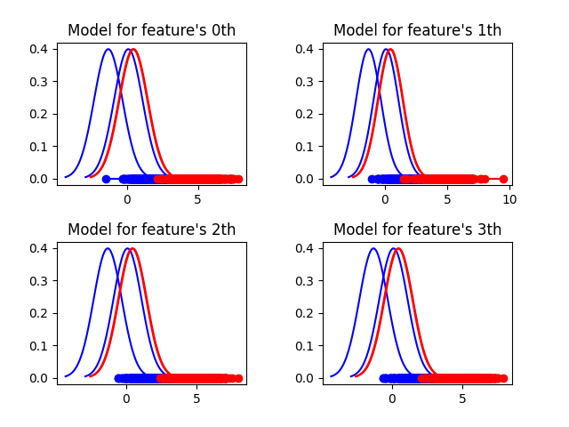
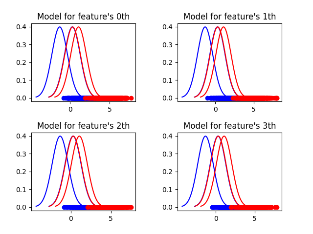
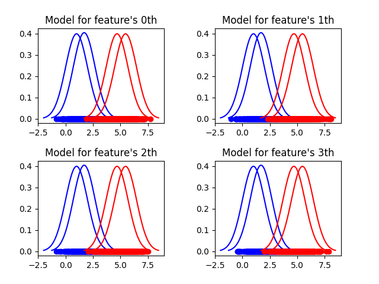
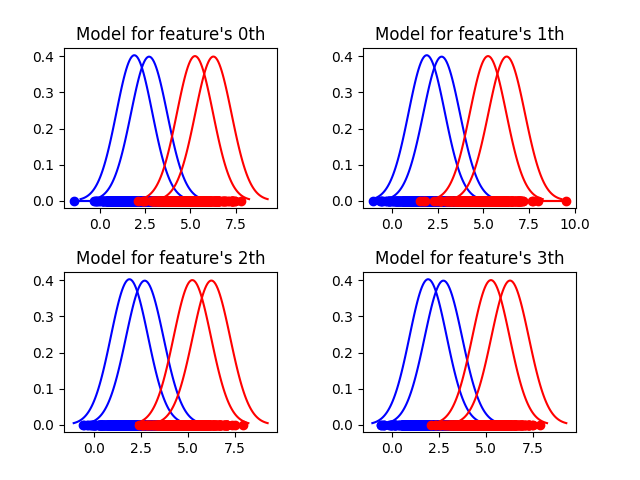
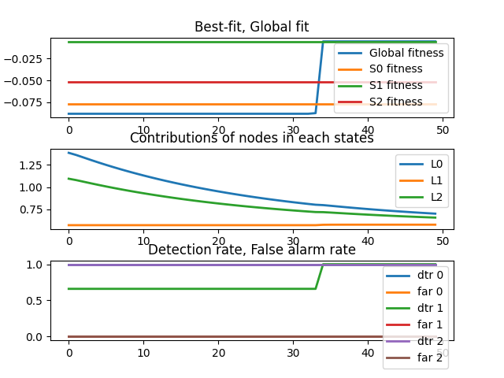
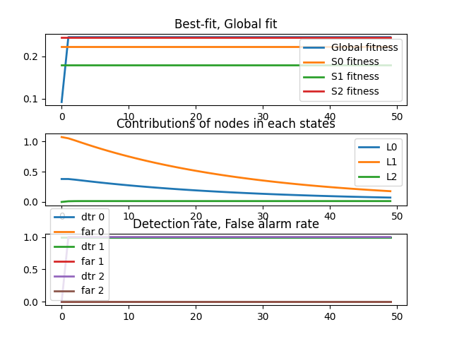

# Distributed-Network-Intrusion-Detection-
This project is an Distributed Network Intrusion Detection framework for assignment of Parallel computing course, Ho Chi Minh University of Technology, Viet Nam.

The framework is referenced from [1]

## HOW TO USE:
### 1. Download Kafka:
- Download from here: [Download](https://www.apache.org/dyn/closer.cgi?path=/kafka/3.1.0/kafka_2.13-3.1.0.tgz)
- tar -xzf kafka_2.13-3.1.0.tgz
- cd kafka_2.13-3.1.0
### 2. Start Kafka environment:
- ./bin/zookeeper-server-start.sh config/zookeeper.properties
- ./bin/kafka-server-start.sh config/server.properties
### 3. Create topic:
- bin/kafka-topics.sh --create --topic model-topic --bootstrap-server localhost:9092 --replication-factor 1 --partitions 1
### 4. Download this github source code:
- cd Distributed-Network-Intrusion-Detection
### 5. Configuration:
- Open file hyper.py:
- N_nodes: Number of nodes, each node is simulated by running same program on different terminal.
- Other interested hyperameter: N_features, N_states, n_components, please read more in paper.
### 6. Run program:
- python main.py --nodeid #id
- replace #id with the order of running program, please start at 0 and increase step by step.

## RESULT:
At this times, this framework is still running on random data. (please see function load_fake_data, file uitls.py for more information).

The result is tested by two nodes, number of states are three, number of components are two.
### Before local training:
<figure>
    
    <figcaption>Node 1.</figcaption>
</figure>

<figure>
    
    <figcaption>Node 2.</figcaption>
</figure>

### After local training:
<figure>
    
    <figcaption>Node 1.</figcaption>
</figure>

<figure>
    
    <figcaption>Node 2.</figcaption>
</figure>

### After global training:
<figure>
    
    <figcaption>Node 1.</figcaption>
</figure>

<figure>
    
    <figcaption>Node 2.</figcaption>
</figure>

## REFERENCE:
1. *Hu, Weiming, et al. "Online adaboost-based parameterized methods for dynamic distributed network intrusion detection." IEEE Transactions on Cybernetics 44.1 (2013): 66-82.*

