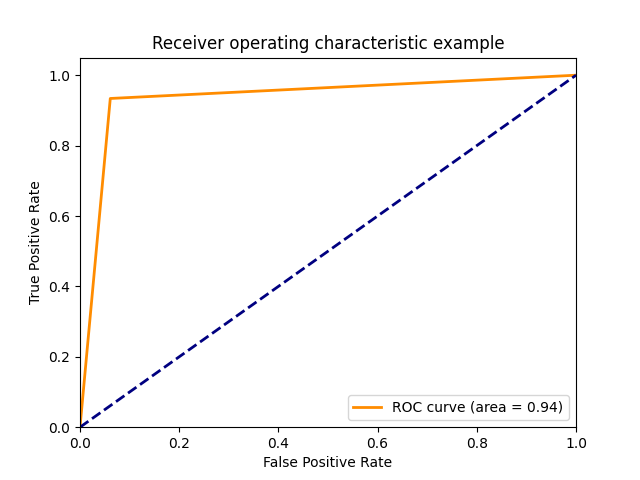

# Online Adaboost-Based Parameterized Methods for Dynamic Distributed Network Intrusion Detection

## Contents

- [Introduction](#introduction)
- [Setup](#setup)
- [Data](#Data)

This implementation is used as an assignment for Parallel computing course, Ho Chi Minh University of Technology, Viet Nam. 

The project is implemented for training and testing Intrusion detection probem using the method describe in 

> W. Hu, J. Gao, Y. Wang, O. Wu and S. Maybank, "Online Adaboost-Based Parameterized Methods for Dynamic Distributed Network Intrusion Detection," in IEEE Transactions on Cybernetics, vol. 44, no. 1, pp. 66-82, Jan. 2014, doi: 10.1109/TCYB.2013.2247592.

## ⚙️ Setup
```
pip install -r requirement.txt
```
Project is conducted using only python 3.9.5 and numpy.

## 💾 KDDcup1999
You can download data from here [KDDcup1999](#http://kdd.ics.uci.edu/databases/kddcup99/kddcup99.html), we choose file *kddcup.data_10_percent.gz* that is used in paper. 
Put .csv file in folder *dataset/*

## ⏳ Local training

Dataset for training local model:

|`Category`|Training data|Test data|
|----------|-------------|---------|
|Normal    |927278       |60593|
|DOS|391458|223295|
|R2L|1126|5993|
|U2R|52|39|
|Probing|4107|2377|
|Others|0|18729|
|Total |494021|311029|

You can train model on your single machine by running below code. 
```
python3 train.py
```
It's take more than hours for Intel(R) Core(TM) i5-4310M CPU @ 2.70GHz.

For more option, please read in options.py or train.sh

## ⏳ Global training
As the dataset has been updated (some new and excluded attack in dataset), local dataset for each nodes doesn't the same as in paper. The local data for six nodes is described below.

Training data:
|Attack types/Nodes|Node 1| Node 2| Node 3|Node 4|Node 5| Node 6|
|------|------|------|------|-----|-----|-----|
|neptune|5000|1000|1000|3500|2500|1500|
|smurf|5000|1000|1000|3500|2500|1500|
|snmpgetattack|0|7741|0|1500|2500|3500|
|mailbomb|0|0|5000|1500|2500|3500|
|normal|10000|10000|10000|10000|10000|10000|

Testing data for each node
|normal|neptune|snmpgetattack|mailbomb|smurf|
|------|-------|-------------|--------|-----|
|295426|164091|58001|7741|5000|

For exchange models parameter from one node to others, we use Kafka as a Message queue. As long as local training step is finished, node will send model parameters to Kafka broker (Producer) , then wait and receive other Node's model parameters. 

In experiment, we use Six nodes from [HPCC Lab](#http://hpcc.hcmut.edu.vn/). However, you may use Cloud, or serveral laptops, or single computer (if you has more than six cores) as long as you can configure them as below. 
:
### Step 1. Download Kafka:
- Download from here: [Download](https://www.apache.org/dyn/closer.cgi?path=/kafka/3.1.0/kafka_2.13-3.1.0.tgz)
- tar -xzf kafka_2.13-3.1.0.tgz
- cd kafka_2.13-3.1.0
### Step 2: Configure Kafka:

### Step 3. Start Kafka environment:
You should run command below for Kafka Node. It can be one of six nodes or independent node. Each command below is run on one terminal:
```
./bin/zookeeper-server-start.sh config/zookeeper.properties
./bin/kafka-server-start.sh config/server.properties
```
### Step 4. Create topic:
Topic "model-topic" will be a destination for nodes to send model parameters.
- bin/kafka-topics.sh --create --topic model-topic --bootstrap-server localhost:9092 --replication-factor 1 --partitions 1

### Step 5. Training:
Open file train.sh, all script for six nodes have been written below GLOBAL TRAINING SCRIPT comment. 

There are 6 command, each are identified by parameter --nodeid. This is essential for node to avoid receive model parameters of itself!.  

Parameter kafka_server is the IP:Port of node that run Kafka server in step 3. 

## 📊 Evaluation
We use True positive rate and False postive rate, as mention in paper. ROC Curve is also be drawed for evaluation.

Evaluation will run after train step has completed. For more detail, please see in file train.py.

Here our result
### Local evaluation:
|gamma|log transform|categorize mode|True postive rate|False positive Rate|
|-----|-------------|---------------|-----------------|-------------------|
|10   |yes          |Discrete to INT|93.89%           |6.61%              |
|10   |yes          |Remove discrete|93.92%           |7.94%              |
|5    |yes          |Discrete to INT|65.74%           |0.64%              |
|15   |yes          |Discrete to INT|97.26%           |28.55%             |
|10   |no           |Discrete to INT|94.14%           |25.39%             |
|10   |no           |Remove discrete|96.64%           |26.91%             |

<figure>
    
    <figcaption>ROC curve for local training first set up.</figcaption>
</figure>

### Global evaluation:
We use 200 and 100 samples for PSO-SVM training. 100 training iteration is applied for step. Number of states in PSO is 6. Experiment is taken for fix and adaptive (mention in equation (40)) inertia weight mode. 

|Inertia weight mode|Metrics|Node 1|Node 2|Node 3|Node 4|Node 5|Node 6|
|--------------|-------------|------|--------|------|------|------|------|
|Fix           |TPR(%)          |92.628|29.084|97.760|29.012|28.924|1.047|
|Fix|FPR(%)|5.930|43.673|25.897|43.528|40.277|1.172|
Vary|TPR(%)|94.534|98.733|98.367|97.766|24.650|94.492|
Vary|FPR(%)|63.400|67.824|68.182|26.170|0.540|1.023|

